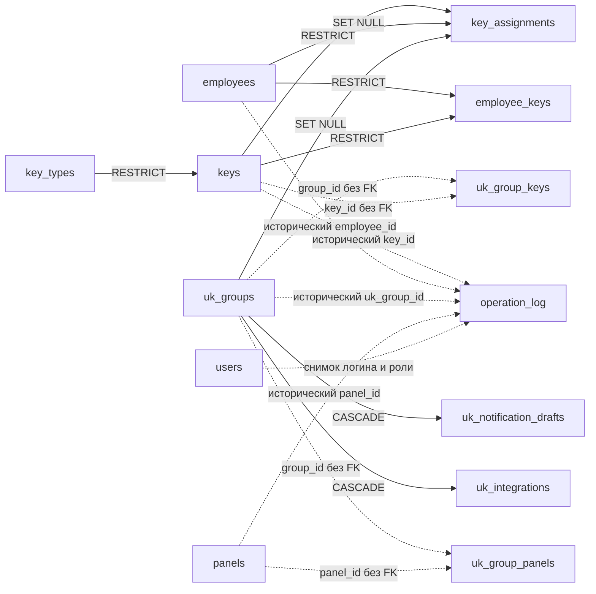
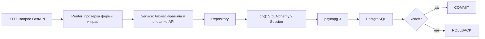

# База данных PostgreSQL

Документ описывает фактическую структуру, закреплённую начальной миграцией
Alembic `20260724_01`. Типы дат и времени намеренно оставлены `TEXT`: текущее
приложение хранит и обрабатывает их как ISO-подобные строки. Менять их на
`timestamp` без отдельной миграции бизнес-логики нельзя.

## Важные особенности исходной структуры

При read-only аудите `data/app.db` обнаружены особенности, которые начальная
миграция сохраняет без скрытого «исправления»:

- `uk_group_panels` и `uk_group_keys` не имеют ни первичного ключа, ни внешних
  ключей. Есть только уникальность пары ID. Ссылочная целостность этих таблиц
  обеспечивается прикладным кодом.
- `operation_log.key_id`, `employee_id`, `uk_group_id` и `panel_id` являются
  историческими идентификаторами, но не внешними ключами. Поэтому журнал
  сохраняется после удаления объекта, однако база не проверяет существование
  указанного ID.
- назначение сотруднику представлено одновременно в `key_assignments` и
  `employee_keys`: первая таблица унифицирует все назначения, вторая хранит
  специальную историю выдачи сотрудникам. Прикладной сервис синхронизирует обе.
- в `keys` одновременно хранятся нормализованный `key_type_id` и устаревшее
  текстовое поле `key_type`, а также `status` и совместимый флаг `is_used`.
- `assignment_type` и статусы — текст без `CHECK`-ограничений. Допустимые
  значения проверяет приложение.
- в исходной SQLite, вопреки ожиданию о пустых остальных таблицах, найдены:
  `key_types = 5`, `keys = 3`, `operation_log = 13`. По заданным правилам
  скрипт переносит только `employees` и `users`; эти 21 запись не копируются.

Это известный технический долг. Добавление отсутствующих FK, нормализация
статусов и объединение таблиц назначений требуют отдельного согласованного
изменения бизнес-логики.

## Общая схема

Сплошные стрелки — реальные внешние ключи PostgreSQL. Пунктирные — только
логические ссылки без FK.



## Основные и связующие таблицы

Основные реестры: `key_types`, `keys`, `employees`, `users`, `panels`,
`uk_groups`. Операционные сущности: `key_assignments`, `employee_keys`,
`operation_log`, `uk_notification_drafts`, `uk_integrations`. Связующие таблицы:
`uk_group_panels`, `uk_group_keys`.

## Таблицы и колонки

### `key_types`

Справочник типов физических ключей.

| Колонка | Тип и ограничения | Назначение |
|---|---|---|
| `id` | `INTEGER`, PK, autoincrement | Идентификатор типа. |
| `name` | `TEXT NOT NULL` | Отображаемое имя типа. |
| `color` | `TEXT NOT NULL`, default `#2A9DF4` | Цвет типа в интерфейсе. |
| `note` | `TEXT`, default `''` | Комментарий. |
| `enabled` | `INTEGER NOT NULL`, default `1` | `1` — доступен, `0` — архивирован. |
| `created_at` | `TEXT NOT NULL`, default current time | Время создания. |
| `updated_at` | `TEXT NOT NULL`, default current time | Время изменения. |

Ограничения и индексы: PK `id`; функциональный уникальный индекс
`uq_key_types_name_ci` на `lower(name)`. Он повторяет регистронезависимую
уникальность SQLite `COLLATE NOCASE`.

### `keys`

Главный реестр ключей.

| Колонка | Тип и ограничения | Назначение |
|---|---|---|
| `id` | `INTEGER`, PK, autoincrement | Внутренний ID ключа. |
| `key_type_id` | `INTEGER NOT NULL`, FK | Тип ключа. |
| `number` | `TEXT NOT NULL` | Печатный/учётный номер внутри типа. |
| `hex_value` | `TEXT NOT NULL`, default `''` | HEX со считывателя. Прикладной код не сохраняет рабочий ключ без HEX. |
| `key_type` | `TEXT`, default `''` | Денормализованное старое имя типа для совместимости. |
| `status` | `TEXT NOT NULL`, default `free` | Текущее состояние ключа. |
| `note` | `TEXT`, default `''` | Комментарий. |
| `is_used` | `INTEGER NOT NULL`, default `0` | Старый совместимый признак использования. |
| `created_at` | `TEXT NOT NULL`, default current time | Дата добавления. |
| `updated_at` | `TEXT NOT NULL`, default current time | Дата изменения. |
| `created_by` | `TEXT`, default `''` | Кто добавил ключ. |

FK: `key_type_id -> key_types.id ON DELETE RESTRICT`.

Индексы:

- уникальный `idx_keys_type_number` на
  `(key_type_id, lower(number))`;
- `idx_keys_hex_lookup` на `lower(hex_value)`; он не уникальный, поэтому
  проверка дубля HEX дополнительно выполняется приложением;
- `idx_keys_status` на `(status, key_type_id)`.

### `employees`

Карточки сотрудников.

| Колонка | Тип и ограничения | Назначение |
|---|---|---|
| `id` | `INTEGER`, PK, autoincrement | ID сотрудника. |
| `full_name` | `TEXT NOT NULL` | ФИО. |
| `note` | `TEXT`, default `''` | Комментарий. |
| `enabled` | `INTEGER`, default `1` | `1` — работает, `0` — уволен/неактивен. |
| `created_at` | `TEXT`, default current time | Создание карточки. |
| `updated_at` | `TEXT`, default `''` | Последнее изменение. |
| `dismissed_at` | `TEXT NULL` | Дата увольнения. |
| `position` | `TEXT`, default `''` | Должность. |
| `department` | `TEXT`, default `''` | Подразделение. |
| `phone` | `TEXT`, default `''` | Телефон. |
| `email` | `TEXT`, default `''` | Email. |
| `created_by` | `TEXT`, default `''` | Кто создал карточку. |

PK: `id`. Других ограничений и индексов в фактической схеме нет.

### `users`

Учётные записи операторов приложения.

| Колонка | Тип и ограничения | Назначение |
|---|---|---|
| `id` | `INTEGER`, PK, autoincrement | ID пользователя. |
| `full_name` | `TEXT NOT NULL` | Отображаемое имя. |
| `login` | `TEXT NOT NULL UNIQUE` | Логин. |
| `password_hash` | `TEXT NOT NULL` | Хеш пароля. |
| `role` | `TEXT NOT NULL`, default `operator` | Роль: прикладной код поддерживает модель ролей. |
| `active` | `INTEGER`, default `1` | Разрешён ли вход. |
| `created_at` | `TEXT`, default current time | Дата создания. |
| `last_login` | `TEXT`, default `''` | Последний вход. |

PK: `id`; уникальное ограничение `uq_users_login`.

### `panels`

Реестр домофонных панелей и последний известный снимок их состояния.

| Колонка | Тип и ограничения | Назначение |
|---|---|---|
| `id` | `INTEGER`, PK, autoincrement | ID панели. |
| `address` | `TEXT NOT NULL` | Адрес. |
| `entrance` | `TEXT`, default `''` | Подъезд/вход. |
| `name` | `TEXT NOT NULL` | Внутреннее имя панели. |
| `mac` | `TEXT NOT NULL UNIQUE` | MAC-адрес. |
| `tags` | `TEXT`, default `''` | Служебные метки. |
| `enabled` | `INTEGER`, default `1` | Включена ли запись панели. |
| `created_at` | `TEXT`, default current time | Дата добавления. |
| `ip` | `TEXT`, default `''` | IP-адрес панели. |
| `api_status` | `TEXT`, default `unknown` | Последний статус API. |
| `last_checked_at` | `TEXT`, default `''` | Время последней проверки. |
| `last_online_at` | `TEXT`, default `''` | Последнее успешное соединение. |
| `response_time_ms` | `INTEGER NULL` | Время ответа, мс. |
| `device_model` | `TEXT`, default `''` | Модель устройства. |
| `firmware_version` | `TEXT`, default `''` | Версия прошивки. |
| `temperature` | `DOUBLE PRECISION NULL` | Температура, если API её вернул. |
| `uptime_seconds` | `INTEGER NULL` | Время работы в секундах. |
| `sip_registered` | `INTEGER NULL` | Снимок SIP-регистрации. |
| `reported_mac` | `TEXT`, default `''` | MAC, сообщённый самой панелью. |
| `last_error` | `TEXT`, default `''` | Последняя ошибка проверки. |
| `supply_voltage` | `DOUBLE PRECISION NULL` | Напряжение питания из `GET /v1/mcu/info`, `power.dc`. |

PK `id`; unique `mac`; индексы `idx_panels_api_status(enabled, api_status)` и
`idx_panels_address_entrance(address, entrance)`.

### `uk_groups`

Реестр управляющих компаний и данных о сотрудничестве.

| Колонка | Тип и ограничения | Назначение |
|---|---|---|
| `id` | `INTEGER`, PK, autoincrement | ID УК. |
| `name` | `TEXT NOT NULL UNIQUE` | Короткое название. |
| `note` | `TEXT`, default `''` | Комментарий. |
| `crm_login` | `TEXT`, default `''` | Служебный логин CRM, сохранён для совместимости. |
| `crm_password` | `TEXT`, default `''` | Служебный пароль CRM, сохранён для совместимости. |
| `legal_name` | `TEXT`, default `''` | Юридическое наименование. |
| `contact_name` | `TEXT`, default `''` | Контактное лицо. |
| `phone` | `TEXT`, default `''` | Телефон. |
| `email` | `TEXT`, default `''` | Email. |
| `legal_address` | `TEXT`, default `''` | Юридический адрес. |
| `contract_number` | `TEXT`, default `''` | Номер договора. |
| `created_by` | `TEXT`, default `''` | Кто создал запись. |
| `updated_at` | `TEXT`, default `''` | Последнее изменение. |
| `cooperation_status` | `TEXT NOT NULL`, default `potential` | Стадия сотрудничества. |
| `account_manager` | `TEXT`, default `''` | Ответственный менеджер. |
| `next_contact_at` | `TEXT`, default `''` | Дата следующего контакта. |
| `cooperation_note` | `TEXT`, default `''` | Примечание по сотрудничеству. |

PK `id`; unique `name`; дополнительный индекс `idx_uk_groups_name(name)`.

### `uk_group_panels`

Логическая связь многие-ко-многим между УК и панелями.

| Колонка | Тип и ограничения | Назначение |
|---|---|---|
| `group_id` | `INTEGER NOT NULL` | Логическая ссылка на `uk_groups.id`. |
| `panel_id` | `INTEGER NOT NULL` | Логическая ссылка на `panels.id`. |

Уникальна пара `(group_id, panel_id)`. PK и FK отсутствуют. Связь удаляется
прикладным кодом перед физическим удалением УК или панели.

### `uk_group_keys`

Логическая связь многие-ко-многим между УК и ключами.

| Колонка | Тип и ограничения | Назначение |
|---|---|---|
| `group_id` | `INTEGER NOT NULL` | Логическая ссылка на `uk_groups.id`. |
| `key_id` | `INTEGER NOT NULL` | Логическая ссылка на `keys.id`. |

Уникальна пара `(group_id, key_id)`. PK и FK отсутствуют.

### `key_assignments`

Единая текущая и историческая таблица назначения ключа жильцу, сотруднику или
УК.

| Колонка | Тип и ограничения | Назначение |
|---|---|---|
| `id` | `INTEGER`, PK, autoincrement | ID назначения. |
| `key_id` | `INTEGER NOT NULL`, FK | Назначенный ключ. |
| `assignment_type` | `TEXT NOT NULL` | `resident`, `employee` или `uk`. |
| `address` | `TEXT`, default `''` | Адрес назначения жильцу. |
| `apartment` | `TEXT`, default `''` | Квартира жильца. |
| `employee_id` | `INTEGER NULL`, FK | Сотрудник для типа `employee`. |
| `uk_group_id` | `INTEGER NULL`, FK | УК для типа `uk`. |
| `assigned_at` | `TEXT NOT NULL`, default current time | Начало назначения. |
| `assigned_by` | `TEXT`, default `''` | Оператор. |
| `released_at` | `TEXT NULL` | Завершение назначения. |
| `active` | `INTEGER NOT NULL`, default `1` | `1` — текущее, `0` — история. |
| `note` | `TEXT`, default `''` | Комментарий. |

FK:

- `key_id -> keys.id ON DELETE RESTRICT`;
- `employee_id -> employees.id ON DELETE SET NULL`;
- `uk_group_id -> uk_groups.id ON DELETE SET NULL`.

Индексы: уникальный частичный `idx_key_assignments_one_active(key_id) WHERE
active = 1`; `idx_key_assignments_lookup(assignment_type, active,
assigned_at)`; `idx_key_assignments_key_history(key_id, active, assigned_at)`.

### `employee_keys`

Специализированная история выдачи нескольких ключей сотруднику.

| Колонка | Тип и ограничения | Назначение |
|---|---|---|
| `id` | `INTEGER`, PK, autoincrement | ID записи выдачи. |
| `employee_id` | `INTEGER NOT NULL`, FK | Сотрудник. |
| `key_id` | `INTEGER NOT NULL`, FK | Ключ. |
| `status` | `TEXT NOT NULL`, default `active` | Состояние выдачи: активна или закрыта с причиной. |
| `issued_at` | `TEXT NOT NULL`, default current time | Время выдачи. |
| `closed_at` | `TEXT NULL` | Время закрытия. |
| `close_reason` | `TEXT`, default `''` | Причина закрытия. |
| `comment` | `TEXT`, default `''` | Комментарий. |
| `created_at` | `TEXT NOT NULL`, default current time | Создание. |
| `updated_at` | `TEXT NOT NULL`, default current time | Изменение. |

FK: `employee_id -> employees.id ON DELETE RESTRICT`,
`key_id -> keys.id ON DELETE RESTRICT`.

Уникальна пара `(employee_id, key_id)`. Частичный уникальный индекс
`idx_employee_keys_one_active_employee_per_key(key_id) WHERE status =
'active'` запрещает одновременную активную выдачу одного ключа разным
сотрудникам, но не ограничивает количество разных активных ключей у сотрудника.
Индекс истории:
`idx_employee_keys_employee_history(employee_id, status, issued_at)`.

### `operation_log`

Неизменяемый на уровне текущего приложения аудит действий и ответов внешних
систем.

| Колонка | Тип и ограничения | Назначение |
|---|---|---|
| `id` | `INTEGER`, PK, autoincrement | ID события. |
| `mode` | `TEXT NOT NULL` | Режим/источник операции. |
| `printed_number` | `TEXT`, default `''` | Печатный номер ключа. |
| `hex_value` | `TEXT NOT NULL` | HEX на момент операции. |
| `flat_num` | `TEXT`, default `''` | Старое поле квартиры. |
| `mac` | `TEXT NOT NULL` | MAC панели на момент операции. |
| `panel_name` | `TEXT`, default `''` | Имя панели. |
| `status` | `TEXT NOT NULL` | Результат операции. |
| `response` | `TEXT`, default `''` | Ответ CRM/панели. |
| `created_at` | `TEXT`, default current time | Время события. |
| `address` | `TEXT`, default `''` | Адрес. |
| `apartment` | `TEXT`, default `''` | Квартира. |
| `username` | `TEXT`, default `''` | Логин оператора. |
| `user_full_name` | `TEXT`, default `''` | Имя оператора. |
| `user_role` | `TEXT`, default `''` | Роль оператора. |
| `action` | `TEXT`, default `''` | Нормализованное действие. |
| `object_type` | `TEXT`, default `''` | Тип объекта. |
| `object_name` | `TEXT`, default `''` | Читаемое имя объекта. |
| `details` | `TEXT`, default `''` | Подробности. |
| `ip_address` | `TEXT`, default `''` | IP клиента. |
| `key_id` | `INTEGER NULL`, без FK | Исторический ID ключа. |
| `key_type` | `TEXT`, default `''` | Тип ключа на момент события. |
| `employee_id` | `INTEGER NULL`, без FK | Исторический ID сотрудника. |
| `uk_group_id` | `INTEGER NULL`, без FK | Исторический ID УК. |
| `comment` | `TEXT`, default `''` | Комментарий. |
| `panel_id` | `INTEGER NULL`, без FK | Исторический ID панели. |

PK `id`; индекс `idx_operation_log_key_id(key_id)`. Внешних ключей нет.

### `uk_notification_drafts`

Черновики собственных уведомлений УК собственникам/жителям.

| Колонка | Тип и ограничения | Назначение |
|---|---|---|
| `id` | `INTEGER`, PK, autoincrement | ID черновика. |
| `group_id` | `INTEGER NOT NULL`, FK | УК-владелец. |
| `title` | `TEXT NOT NULL` | Заголовок. |
| `body` | `TEXT NOT NULL` | Текст. |
| `category` | `TEXT NOT NULL`, default `announcement` | Категория. |
| `channel` | `TEXT NOT NULL`, default `dtel` | Планируемый канал. |
| `audience` | `TEXT NOT NULL`, default `all` | Целевая аудитория. |
| `audience_details` | `TEXT`, default `''` | Уточнение аудитории. |
| `created_by` | `TEXT`, default `''` | Автор. |
| `created_at` | `TEXT NOT NULL`, default current time | Создание. |
| `updated_at` | `TEXT NOT NULL`, default current time | Изменение. |

FK `group_id -> uk_groups.id ON DELETE CASCADE`. Индекс
`idx_uk_notification_drafts_group(group_id, created_at DESC)`.

### `uk_integrations`

Таблица присутствовала в фактической SQLite-схеме и поэтому сохранена, хотя
текущая страница УК её не использует.

| Колонка | Тип и ограничения | Назначение |
|---|---|---|
| `id` | `INTEGER`, PK, autoincrement | ID записи. |
| `group_id` | `INTEGER NOT NULL`, FK | УК. |
| `service_name` | `TEXT NOT NULL` | Имя внешнего сервиса. |
| `integration_type` | `TEXT NOT NULL`, default `api` | Тип интеграции. |
| `base_url` | `TEXT`, default `''` | URL сервиса. |
| `login` | `TEXT`, default `''` | Логин. |
| `auth_type` | `TEXT NOT NULL`, default `not_selected` | Тип авторизации. |
| `status` | `TEXT NOT NULL`, default `planned` | Состояние. |
| `enabled` | `INTEGER NOT NULL`, default `0` | Активность. |
| `note` | `TEXT`, default `''` | Комментарий. |
| `last_sync_at` | `TEXT`, default `''` | Последняя синхронизация. |
| `last_error` | `TEXT`, default `''` | Последняя ошибка. |
| `created_at` | `TEXT NOT NULL`, default current time | Создание. |
| `updated_at` | `TEXT NOT NULL`, default current time | Изменение. |

FK `group_id -> uk_groups.id ON DELETE CASCADE`. Регистронезависимо уникальна
пара `(group_id, lower(service_name))`. Индекс
`idx_uk_integrations_group(group_id, status, service_name)`.

## Жизненный цикл ключа

### Создание

1. Оператор выбирает или создаёт `key_types`.
2. Приложение получает номер и обязательный HEX. Подготовительный экран может
   показывать незавершённую строку, но запись в `keys` создаётся после получения
   HEX.
3. Репозиторий проверяет активность типа, уникальность номера внутри типа и
   прикладным запросом — конфликт HEX.
4. Создаётся `keys` со статусом `free`, `is_used = 0`.
5. Изменение выполняется в транзакции SQLAlchemy Session; при ошибке вся
   транзакция откатывается.

### Назначение жильцу/квартире

Создаётся активная строка `key_assignments` с
`assignment_type = 'resident'`, заполненными `address` и `apartment`.
`employee_id` и `uk_group_id` остаются `NULL`. Статус ключа становится
`issued_resident`.

### Назначение сотруднику

Создаются синхронные записи:

- `key_assignments` с `assignment_type = 'employee'` и `employee_id`;
- `employee_keys` со статусом `active`.

Ключ получает `issued_employee`. У одного сотрудника может быть несколько
активных ключей. Один физический ключ может иметь только одно активное
назначение благодаря двум частичным уникальным индексам.

### Назначение группе УК

Создаётся `key_assignments` с `assignment_type = 'uk'` и `uk_group_id`, а также
логическая строка `uk_group_keys`. Статус ключа — `assigned_uk`.

### Определение статуса

Основной источник — сохранённое поле `keys.status`, а не вычисление при каждом
чтении:

- `free` — свободен;
- `issued_resident` — выдан жильцу;
- `issued_employee` — выдан сотруднику;
- `assigned_uk` — закреплён за УК;
- `blocked` — заблокирован;
- `lost` — утерян;
- `defective` — брак;
- `archived` — архив.

Назначение обновляет статус и совместимый `is_used`. Освобождение закрывает
активную строку `key_assignments` (`active = 0`, `released_at`), закрывает
активную запись `employee_keys`, удаляет актуальную логическую связь с УК и
возвращает ключ в `free`. Перевод в `blocked`, `lost`, `defective` или
`archived` сначала освобождает текущее назначение.

## Журнал операций

HTTP-операции и ответы внешних систем передают снимок контекста в сервис
аудита, который добавляет `operation_log`. В строке сохраняются не только ID,
но и номер/HEX, адрес, панель и имя/роль оператора. Поэтому запись остаётся
читаемой после изменения основной карточки. Текущий код журнал не обновляет и
не удаляет. Отсутствие FK к объектам — фактическое свойство схемы, позволяющее
сохранить аудит при физическом удалении, но допускающее несуществующие ID.

## Физическое и мягкое удаление

- `employees`: мягкое удаление — `enabled = 0`, `dismissed_at`; активные выдачи
  закрываются. История сохраняется.
- `key_types`: архивирование через `enabled = 0`.
- `keys`: служебное архивирование через `status = 'archived'`; штатного
  физического удаления в текущем интерфейсе нет.
- `panels`: физическое удаление после ручного удаления строк
  `uk_group_panels`.
- `uk_groups`: физическое удаление; сначала освобождаются активные ключи и
  вручную удаляются строки обеих связующих таблиц. Черновики уведомлений и
  записи интеграций удаляются PostgreSQL через `CASCADE`; ссылки истории в
  `key_assignments` становятся `NULL` через `SET NULL`.
- `users`: физическое удаление, кроме защищённого последнего администратора на
  уровне бизнес-логики.
- `uk_notification_drafts`: физическое удаление.
- `operation_log`: штатно не удаляется.

## Порядок создания и удаления связанных записей

Создание: `key_types` → `keys`; `employees`/`uk_groups` → назначение;
`panels`/`uk_groups` → логические связующие строки. Для сотрудника
`key_assignments` и `employee_keys` создаются в одной прикладной транзакции.

Удаление выполняется в обратном порядке. `RESTRICT` не позволяет удалить тип с
ключами, ключ с назначениями/историей сотрудника или сотрудника с
`employee_keys`. Перед удалением панели/УК приложение обязано убрать строки
связующих таблиц, поскольку FK там отсутствуют. `CASCADE` используется только
для дочерних `uk_notification_drafts` и `uk_integrations`; `SET NULL` — для
истории назначения при удалении сотрудника или УК.

## Движение данных от HTTP до PostgreSQL



`DATABASE_URL` загружается `pydantic-settings` из `.env`. Приложение при
старте проверяет соединение и наличие схемы, но не создаёт и не изменяет
таблицы. Схемой управляет только Alembic.

## Миграция данных из SQLite

`scripts/migrate_sqlite_to_postgres.py`:

- открывает SQLite как `mode=ro&immutable=1`;
- проверяет SHA-256 до и после;
- читает и переносит только `employees` и `users`;
- сохраняет `id` и все остальные колонки;
- не перезаписывает конфликтующие строки;
- после вставки синхронизирует PostgreSQL sequences;
- в одной транзакции сравнивает количество строк источника и приёмника;
- поддерживает повторный запуск и `--verify-only`.

Исходный `data/app.db` не удаляется и не изменяется.

## Резервное копирование и восстановление

Перед миграциями и релизом рекомендуется логический дамп:

```bash
PG_URL="${DATABASE_URL/postgresql+psycopg:/postgresql:}"
pg_dump --format=custom --no-owner --file=dtel_YYYYMMDD.dump --dbname="$PG_URL"
```

Для ежедневных резервных копий хранить несколько поколений дампов вне хоста
PostgreSQL, шифровать их и регулярно проверять тестовое восстановление.
Восстановление в пустую базу:

```bash
createdb dtel_restore
pg_restore --clean --if-exists --no-owner --dbname=dtel_restore dtel_YYYYMMDD.dump
```

После восстановления выполнить:

```bash
alembic current
python scripts/migrate_sqlite_to_postgres.py --verify-only
python scripts/smoke_postgres_crud.py
```

Для больших объёмов и строгого RPO дополнительно применять физические base
backup и архивирование WAL средствами PostgreSQL/провайдера. Пароли из `.env`,
дампы и исходный `data/app.db` не должны попадать в Git.
