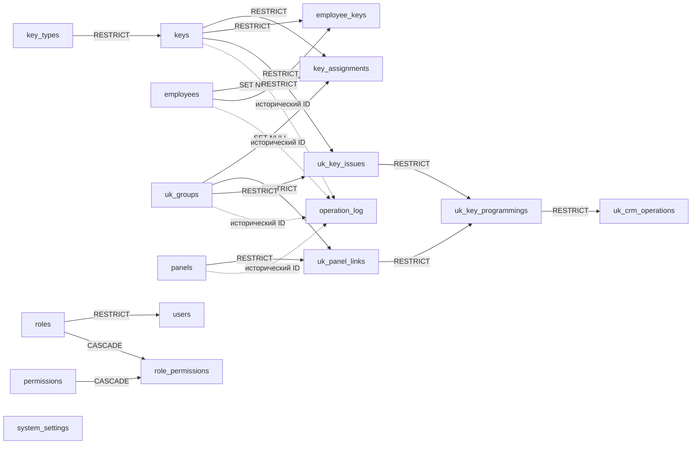
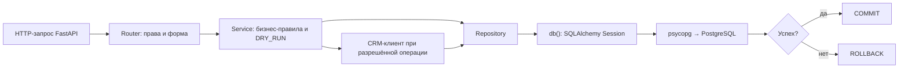

# База данных PostgreSQL

Документ описывает фактическую структуру SQLAlchemy и Alembic после ревизии
`20260730_06`. Рабочий движок — PostgreSQL через `SQLAlchemy 2` и
`psycopg`; URL подключения берётся из `DATABASE_URL`.

## Общая схема


```mermaid
flowchart LR
    KT["key_types"] -->|RESTRICT| K["keys"]
    K -->|RESTRICT| KA["key_assignments"]
    E["employees"] -->|SET NULL| KA
    UK["uk_groups"] -->|SET NULL| KA
    E -->|RESTRICT| EK["employee_keys"]
    K -->|RESTRICT| EK

    UK -->|RESTRICT| UPL["uk_panel_links"]
    P["panels"] -->|RESTRICT| UPL
    UK -->|RESTRICT| UKI["uk_key_issues"]
    K -->|RESTRICT| UKI
    UKI -->|RESTRICT| UKP["uk_key_programmings"]
    UPL -->|RESTRICT| UKP
    UKP -->|RESTRICT| UCO["uk_crm_operations"]

    R["roles"] -->|RESTRICT| U["users"]
    R -->|CASCADE| RP["role_permissions"]
    PM["permissions"] -->|CASCADE| RP
    SS["system_settings"]

    K -. "исторический ID" .-> OL["operation_log"]
    E -. "исторический ID" .-> OL
    UK -. "исторический ID" .-> OL
    P -. "исторический ID" .-> OL
```

Основные реестры: `key_types`, `keys`, `employees`, `users`, `roles`, `panels`,
`uk_groups`. Связующие и операционные таблицы: `key_assignments`,
`employee_keys`, `role_permissions`, `uk_panel_links`, `uk_key_issues`,
`uk_key_programmings`, `uk_crm_operations`, `operation_log`.
Служебные таблицы: `panel_monitor_state` и `system_settings`.

`operation_log` намеренно не имеет внешних ключей: он хранит снимок данных и
остаётся читаемым после архивирования или изменения исходного объекта.

## Таблицы

### `key_types`

Справочник типов физических ключей.

| Колонка | Тип | Назначение |
|---|---|---|
| `id` | `INTEGER`, PK | ID типа. |
| `name` | `TEXT NOT NULL` | Название типа. |
| `color` | `TEXT NOT NULL` | Цвет в интерфейсе. |
| `note` | `TEXT` | Комментарий. |
| `enabled` | `INTEGER NOT NULL` | Активность типа. |
| `created_at` | `TEXT NOT NULL` | Создание. |
| `updated_at` | `TEXT NOT NULL` | Изменение. |

Индекс `uq_key_types_name_ci` уникален по `lower(name)`.

### `keys`

Главный реестр физических ключей.

| Колонка | Тип | Назначение |
|---|---|---|
| `id` | `INTEGER`, PK | Внутренний ID. |
| `key_type_id` | `INTEGER NOT NULL`, FK | Тип ключа. |
| `number` | `TEXT NOT NULL` | Учётный номер внутри типа. |
| `hex_value` | `TEXT NOT NULL` | HEX со считывателя. |
| `key_type` | `TEXT` | Старое текстовое имя типа для совместимости. |
| `status` | `TEXT NOT NULL` | Текущее состояние ключа. |
| `note` | `TEXT` | Комментарий. |
| `is_used` | `INTEGER NOT NULL` | Совместимый признак использования. |
| `created_at` | `TEXT NOT NULL` | Создание. |
| `updated_at` | `TEXT NOT NULL` | Изменение. |
| `created_by` | `TEXT` | Автор. |

FK `key_type_id → key_types.id ON DELETE RESTRICT`. Уникальный индекс
`idx_keys_type_number` действует на `(key_type_id, lower(number))`;
`idx_keys_hex_lookup` ускоряет поиск по HEX, `idx_keys_status` — по статусу.
Рабочий ключ без HEX прикладной код не создаёт и не назначает.

### `employees`

| Колонка | Тип | Назначение |
|---|---|---|
| `id` | `INTEGER`, PK | ID сотрудника. |
| `full_name` | `TEXT NOT NULL` | ФИО. |
| `note` | `TEXT` | Комментарий. |
| `enabled` | `INTEGER` | Активен/уволен. |
| `created_at` | `TEXT` | Создание. |
| `updated_at` | `TEXT` | Изменение. |
| `dismissed_at` | `TEXT NULL` | Дата увольнения. |
| `position` | `TEXT` | Должность. |
| `department` | `TEXT` | Подразделение. |
| `phone` | `TEXT` | Телефон. |
| `email` | `TEXT` | Email. |
| `created_by` | `TEXT` | Автор. |

### `users`

| Колонка | Тип | Назначение |
|---|---|---|
| `id` | `INTEGER`, PK | ID пользователя. |
| `full_name` | `TEXT NOT NULL` | Имя. |
| `login` | `TEXT NOT NULL UNIQUE` | Логин. |
| `password_hash` | `TEXT NOT NULL` | Хеш пароля. |
| `role_id` | `INTEGER NOT NULL`, FK | Одна назначенная роль. |
| `active` | `INTEGER` | Доступ разрешён. |
| `created_at` | `TEXT` | Создание. |
| `last_login` | `TEXT` | Последний вход. |

FK `role_id → roles.id ON DELETE RESTRICT`: роль нельзя удалить, пока она
назначена хотя бы одному пользователю. Прикладная логика дополнительно
запрещает удалить, отключить или понизить последнего активного администратора.

### `roles`

Справочник системных и пользовательских ролей.

| Колонка | Тип | Назначение |
|---|---|---|
| `id` | `INTEGER`, PK | ID роли. |
| `code` | `TEXT NOT NULL UNIQUE` | Стабильный машинный код. |
| `name` | `TEXT NOT NULL` | Отображаемое название. |
| `description` | `TEXT NOT NULL` | Назначение роли. |
| `is_system` | `BOOLEAN NOT NULL` | Признак системной роли. |
| `created_at` | `TEXT NOT NULL` | Создание. |
| `updated_at` | `TEXT NOT NULL` | Последнее изменение. |

Индекс `uq_roles_name_ci` уникален по `lower(name)`. Системные роли
`admin`, `operator`, `viewer` нельзя удалить. У роли `admin` нельзя снять
критические разрешения `view`, `manage_users`, `manage_settings`.

### `permissions`

Фиксированный справочник разрешений. Колонки: `id INTEGER PK`,
`code TEXT UNIQUE NOT NULL`, `name TEXT NOT NULL`, `description TEXT NOT NULL`.
Созданы разрешения просмотра, записи и управления ключами, панелями, УК,
сотрудниками, журналами, пользователями и системными настройками.

### `role_permissions`

Связующая таблица many-to-many между ролями и разрешениями. Составной
первичный ключ: `(role_id, permission_id)`. Оба FK используют
`ON DELETE CASCADE`, поэтому при удалении пользовательской роли удаляются
только её связи с разрешениями, а сам справочник разрешений сохраняется.

### `panels`

| Колонка | Тип | Назначение |
|---|---|---|
| `id` | `INTEGER`, PK | ID панели. |
| `address` | `TEXT NOT NULL` | Адрес. |
| `entrance` | `TEXT` | Подъезд/вход. |
| `name` | `TEXT NOT NULL` | Название. |
| `mac` | `TEXT NOT NULL UNIQUE` | MAC-адрес. |
| `tags` | `TEXT` | Теги. |
| `enabled` | `INTEGER` | Включена в реестр. |
| `created_at` | `TEXT` | Создание. |
| `ip` | `TEXT` | IP-адрес. |
| `api_status` | `TEXT` | Состояние API. |
| `last_checked_at` | `TIMESTAMPTZ NULL` | Последняя проверка. |
| `last_online_at` | `TIMESTAMPTZ NULL` | Последнее подтверждение связи. |
| `response_time_ms` | `INTEGER NULL` | Отклик. |
| `device_model` | `TEXT` | Модель. |
| `firmware_version` | `TEXT` | Прошивка. |
| `temperature` | `DOUBLE PRECISION NULL` | Температура. |
| `uptime_seconds` | `INTEGER NULL` | Время работы. |
| `sip_registered` | `INTEGER NULL` | SIP-регистрация. |
| `reported_mac` | `TEXT` | MAC из ответа устройства. |
| `last_error` | `TEXT` | Последняя ошибка. |
| `supply_voltage` | `DOUBLE PRECISION NULL` | Напряжение `power.dc`. |

Индексы: `idx_panels_api_status(enabled, api_status)` и
`idx_panels_address_entrance(address, entrance)`.

### `panel_monitor_state`

Одна служебная строка (`id = 1`) хранит состояние централизованного мониторинга
панелей. Таблица позволяет всем процессам приложения и всем открытым браузерам
видеть один общий цикл, не запуская повторные запросы к устройствам.

| Колонка | Тип | Назначение |
|---|---|---|
| `id` | `INTEGER`, PK | Идентификатор единственной строки состояния. |
| `status` | `TEXT NOT NULL` | `idle`, `queued`, `running`, `completed` или `failed`. |
| `total` | `INTEGER NOT NULL` | Число панелей в текущем цикле. |
| `completed` | `INTEGER NOT NULL` | Число уже обработанных панелей. |
| `online` | `INTEGER NOT NULL` | Число успешных проверок текущего цикла. |
| `failed` | `INTEGER NOT NULL` | Число неуспешных проверок текущего цикла. |
| `active_panel_ids` | `JSONB NOT NULL` | ID панелей, которые прямо сейчас опрашиваются. |
| `requested_at` | `TIMESTAMPTZ NULL` | Когда пользователь поставил цикл в очередь. |
| `started_at` | `TIMESTAMPTZ NULL` | Начало обработки. |
| `finished_at` | `TIMESTAMPTZ NULL` | Завершение обработки. |
| `heartbeat_at` | `TIMESTAMPTZ NULL` | Последний признак работы фонового исполнителя. |
| `requested_by` | `TEXT NOT NULL` | Пользователь, запросивший ручной общий цикл. |
| `last_error` | `TEXT NOT NULL` | Безопасное описание ошибки цикла без секретов. |

Ограничение `ck_panel_monitor_state_status` допускает только перечисленные
состояния. Внешних ключей нет: прогресс краткоживущий, а результаты каждой
панели сохраняются в `panels`. Межпроцессная PostgreSQL advisory lock гарантирует,
что одновременно полный цикл выполняет только один процесс приложения.

### `system_settings`

Общие несекретные runtime-параметры приложения. В текущей версии таблица
хранит только параметры мониторинга панелей; пароли, Cookie, токены,
`DATABASE_URL` и `SESSION_SECRET` в неё не записываются.

| Колонка | Тип | Назначение |
|---|---|---|
| `key` | `TEXT`, PK | Стабильный код параметра. |
| `value` | `TEXT NOT NULL` | Нормализованное значение параметра. |
| `updated_at` | `TIMESTAMPTZ NOT NULL` | Время последнего сохранения. |
| `updated_by` | `TEXT NOT NULL` | ФИО или логин администратора. |

Внешних ключей нет. Все worker-процессы читают значения из PostgreSQL перед
новым циклом мониторинга. При отсутствии строки используется исходное значение
из `.env`; после сохранения значение из таблицы имеет приоритет. Изменение
записывается в `operation_log` без секретных данных.

### `uk_groups`

Карточка управляющей компании.

| Колонка | Тип | Назначение |
|---|---|---|
| `id` | `INTEGER`, PK | ID УК. |
| `name` | `TEXT NOT NULL UNIQUE` | Краткое название. |
| `legal_name` | `TEXT` | Юридическое название. |
| `contact_name` | `TEXT` | Контактное лицо. |
| `phone` | `TEXT` | Телефон. |
| `email` | `TEXT` | Email. |
| `legal_address` | `TEXT` | Юридический адрес. |
| `actual_address` | `TEXT` | Фактический адрес. |
| `crm_login` | `TEXT` | Логин CRM. |
| `crm_password` | `TEXT` | Пароль CRM в обычном тексте по принятому решению. |
| `note` | `TEXT` | Комментарий. |
| `created_by` | `TEXT` | Автор. |
| `created_at` | `TIMESTAMPTZ NOT NULL` | Создание. |
| `updated_at` | `TIMESTAMPTZ NOT NULL` | Изменение. |
| `archived_at` | `TIMESTAMPTZ NULL` | Мягкое удаление. |

Пароль не попадает в списочные запросы, URL, журнал или обычный HTML.
Получить его можно отдельным POST-действием администратора; ответ запрещает
кеширование. Пустой пароль в форме редактирования сохраняет прежнее значение.

### `uk_panel_links`

История принадлежности панели УК и индивидуальная квартира учётной записи.

| Колонка | Тип | Назначение |
|---|---|---|
| `id` | `INTEGER`, PK | ID связи. |
| `uk_group_id` | `INTEGER NOT NULL`, FK | УК. |
| `panel_id` | `INTEGER NOT NULL`, FK | Панель. |
| `apartment` | `TEXT NOT NULL` | Квартира CRM именно на этой панели. |
| `comment` | `TEXT` | Комментарий. |
| `active` | `BOOLEAN NOT NULL` | Текущая связь. |
| `created_by` | `TEXT` | Автор. |
| `created_at` | `TIMESTAMPTZ NOT NULL` | Создание. |
| `updated_at` | `TIMESTAMPTZ NOT NULL` | Изменение. |
| `detached_at` | `TIMESTAMPTZ NULL` | Открепление. |

FK к `uk_groups` и `panels` используют `ON DELETE RESTRICT`. Частичные
уникальные индексы запрещают две активные связи одной пары и принадлежность
одной панели двум активным УК. Архивирование УК деактивирует связи, но не
удаляет их.

### `uk_key_issues`

Факт выдачи одного существующего физического ключа одной УК.

| Колонка | Тип | Назначение |
|---|---|---|
| `id` | `INTEGER`, PK | ID выдачи. |
| `uk_group_id` | `INTEGER NOT NULL`, FK | УК. |
| `key_id` | `INTEGER NOT NULL`, FK | Физический ключ. |
| `status` | `TEXT NOT NULL` | `pending`, `active`, `released`, `archived`. |
| `comment` | `TEXT` | Комментарий. |
| `issued_by` | `TEXT` | Оператор. |
| `issued_at` | `TIMESTAMPTZ NOT NULL` | Выдача. |
| `released_at` | `TIMESTAMPTZ NULL` | Освобождение. |
| `created_at` | `TIMESTAMPTZ NOT NULL` | Создание. |
| `updated_at` | `TIMESTAMPTZ NOT NULL` | Изменение. |

Оба FK используют `RESTRICT`. `CHECK` ограничивает статусы. Частичный
уникальный индекс разрешает только одну выдачу `pending/active` для ключа.

### `uk_key_programmings`

Запись одного физического ключа на конкретную панель. Несколько строк одной
выдачи образуют ключ-вездеход.

| Колонка | Тип | Назначение |
|---|---|---|
| `id` | `INTEGER`, PK | ID программирования. |
| `issue_id` | `INTEGER NOT NULL`, FK | Выдача ключа. |
| `panel_link_id` | `INTEGER NOT NULL`, FK | Историческая связь УК с панелью. |
| `apartment` | `TEXT NOT NULL` | Снимок квартиры для CRM-операции. |
| `is_primary` | `BOOLEAN NOT NULL` | Основная панель. |
| `active` | `BOOLEAN NOT NULL` | Актуальная учётная связь. |
| `status` | `TEXT NOT NULL` | `pending`, `success`, `error`, `dry_run`, `unlinked`, `removed`. |
| `last_error` | `TEXT` | Безопасный текст ошибки. |
| `programmed_at` | `TIMESTAMPTZ NULL` | Успешная запись. |
| `removed_at` | `TIMESTAMPTZ NULL` | Успешное удаление из CRM. |
| `unlinked_at` | `TIMESTAMPTZ NULL` | Только учётная отвязка. |
| `created_at` | `TIMESTAMPTZ NOT NULL` | Создание. |
| `updated_at` | `TIMESTAMPTZ NOT NULL` | Изменение. |

FK к выдаче и связи панели используют `RESTRICT`. Частичные уникальные
индексы разрешают одну активную запись выдачи на панель и одну активную
основную панель.

### `uk_crm_operations`

Неизменяемая история попыток записи и удаления ключа в CRM.

| Колонка | Тип | Назначение |
|---|---|---|
| `id` | `INTEGER`, PK | ID попытки. |
| `programming_id` | `INTEGER NOT NULL`, FK | Программирование. |
| `operation` | `TEXT NOT NULL` | `add` или `remove`. |
| `status` | `TEXT NOT NULL` | `pending`, `success`, `error`, `dry_run`. |
| `idempotency_key` | `TEXT NOT NULL UNIQUE` | Идентификатор попытки. |
| `attempt_number` | `INTEGER NOT NULL` | Номер попытки. |
| `safe_response` | `TEXT` | Ответ без логина и пароля. |
| `requested_by` | `TEXT` | Оператор. |
| `started_at` | `TIMESTAMPTZ NOT NULL` | Начало. |
| `completed_at` | `TIMESTAMPTZ NULL` | Завершение. |

FK использует `ON DELETE RESTRICT`; два `CHECK` ограничивают операцию и
статус. Индекс сортирует историю по программированию и времени.

### `key_assignments`

Общая проекция текущего и исторического назначения ключа.

| Колонка | Тип | Назначение |
|---|---|---|
| `id` | `INTEGER`, PK | ID назначения. |
| `key_id` | `INTEGER NOT NULL`, FK | Ключ. |
| `assignment_type` | `TEXT NOT NULL` | `resident`, `employee`, `uk`. |
| `address` | `TEXT` | Адрес жильца/служебное описание. |
| `apartment` | `TEXT` | Квартира. |
| `employee_id` | `INTEGER NULL`, FK | Сотрудник. |
| `uk_group_id` | `INTEGER NULL`, FK | УК. |
| `assigned_at` | `TEXT NOT NULL` | Начало назначения. |
| `assigned_by` | `TEXT` | Оператор. |
| `released_at` | `TEXT NULL` | Завершение. |
| `active` | `INTEGER NOT NULL` | Текущее назначение. |
| `note` | `TEXT` | Комментарий. |

`key_id → keys RESTRICT`; `employee_id → employees SET NULL`;
`uk_group_id → uk_groups SET NULL`. Частичный уникальный индекс обеспечивает
одно активное назначение физического ключа.

### `employee_keys`

Специализированная история выдачи нескольких ключей сотруднику.

| Колонка | Тип | Назначение |
|---|---|---|
| `id` | `INTEGER`, PK | ID выдачи. |
| `employee_id` | `INTEGER NOT NULL`, FK | Сотрудник. |
| `key_id` | `INTEGER NOT NULL`, FK | Ключ. |
| `status` | `TEXT NOT NULL` | Состояние выдачи. |
| `issued_at` | `TEXT NOT NULL` | Выдача. |
| `closed_at` | `TEXT NULL` | Закрытие. |
| `close_reason` | `TEXT` | Причина. |
| `comment` | `TEXT` | Комментарий. |
| `created_at` | `TEXT NOT NULL` | Создание. |
| `updated_at` | `TEXT NOT NULL` | Изменение. |

Оба FK используют `RESTRICT`; уникальна пара `(employee_id, key_id)`.
Частичный индекс разрешает только одного активного сотрудника для ключа.

### `operation_log`

Общий журнал интерфейса и внешних операций.

| Колонка | Назначение |
|---|---|
| `id` | PK события. |
| `mode`, `action`, `object_type`, `object_name` | Классификация. |
| `printed_number`, `hex_value`, `key_type`, `key_id` | Снимок ключа. |
| `flat_num`, `address`, `apartment` | Снимок назначения. |
| `mac`, `panel_name`, `panel_id` | Снимок панели. |
| `status`, `response`, `details`, `comment` | Результат без секретов. |
| `username`, `user_full_name`, `user_role`, `ip_address` | Контекст оператора. |
| `employee_id`, `uk_group_id` | Исторические ID объектов. |
| `created_at` | Время события. |

`id` — `INTEGER` PK; остальные ID в журнале не являются FK. Индекс
`idx_operation_log_key_id` ускоряет историю ключа.

## Жизненный цикл ключа

При создании проверяются тип, номер и обязательный HEX. Запись появляется в
`keys` со статусом `free`. Назначение жильцу создаёт `key_assignments` типа
`resident`; сотруднику — синхронные `key_assignments` и `employee_keys`.

Для УК:

1. выбираются свободный ключ и активная `uk_panel_links`;
2. создаются `uk_key_issues`, основная `uk_key_programmings` и общая проекция
   `key_assignments`;
3. квартира берётся из выбранной связи панели; переопределение требует
   отдельного подтверждения;
4. CRM-результат сохраняется в `uk_crm_operations`;
5. при успехе выдача становится `active`, а ключ — `assigned_uk`;
6. дополнительные панели создают отдельные программирования того же ключа;
7. учётная отвязка не отправляет удаление в CRM;
8. явное удаление из CRM затрагивает только выбранную панель;
9. ключ становится `free`, только когда после успешных CRM-удалений не осталось
   активных программирований.

Основной источник общего статуса — `keys.status`: `free`,
`issued_resident`, `issued_employee`, `assigned_uk`, `blocked`, `lost`,
`defective`, `archived`. Детальный статус записи УК хранится отдельно.

## Удаление и порядок зависимостей

- Сотрудник увольняется мягко: `enabled = 0`, активные выдачи закрываются.
- Тип ключа отключается через `enabled`; ключ архивируется статусом.
- УК архивируется через `archived_at`. Её активные связи с панелями
  деактивируются, CRM-реквизиты очищаются, но УК, панели, ключи, выдачи,
  программирования и история физически не удаляются.
- Панель с историей `uk_panel_links` физически удалить нельзя (`RESTRICT`).
- Учётная связь ключа с одной панелью деактивируется; физический ключ и другие
  программирования сохраняются.
- `uk_crm_operations` и `operation_log` штатно не удаляются.

Порядок создания: `uk_groups` и `panels` → `uk_panel_links`; `keys` →
`uk_key_issues` → `uk_key_programmings` → `uk_crm_operations`. Физическое
удаление возможно только в обратном порядке, но штатный интерфейс использует
архивирование и деактивацию.

`CASCADE` в новой модели УК не используется. `RESTRICT` защищает панели,
ключи и историю; `SET NULL` сохранён только у общей исторической проекции
`key_assignments`.

## Движение данных


```mermaid
flowchart LR
    HTTP["HTTP-запрос FastAPI"] --> R["Router: права и форма"]
    R --> S["Service: бизнес-правила и DRY_RUN"]
    S --> CRM["CRM-клиент при разрешённой операции"]
    S --> RP["Repository"]
    CRM --> RP
    RP --> DB["db(): SQLAlchemy Session"]
    DB --> PG["psycopg → PostgreSQL"]
    PG --> TX{"Успех?"}
    TX -->|да| C["COMMIT"]
    TX -->|нет| RB["ROLLBACK"]
```

Учебный режим останавливает изменяющий HTTP-запрос до роутера. `DRY_RUN`
останавливает CRM-вызов до создания HTTP-сессии; безопасный результат может
сохраняться как `dry_run`.

## Резервное копирование и восстановление

Перед миграцией и регулярно в эксплуатации рекомендуется:

```bash
pg_dump --format=custom --file=key_writer.dump key_writer
createdb key_writer_restore_test
pg_restore --clean --if-exists --dbname=key_writer_restore_test key_writer.dump
```

Восстановление сначала проверяется в отдельной БД: Alembic-ревизия, количество
`employees`, `users`, `panels`, `keys`, целостность FK и выборочные карточки.
Только после проверки допускается плановое восстановление рабочей базы.
Исходный `data/app.db` миграция PostgreSQL не изменяет и не удаляет.
